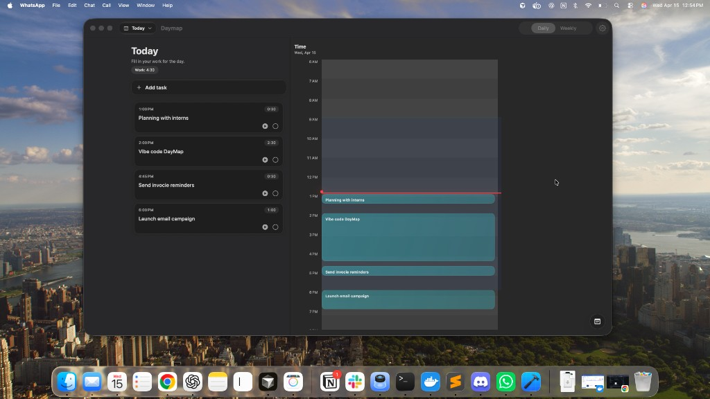
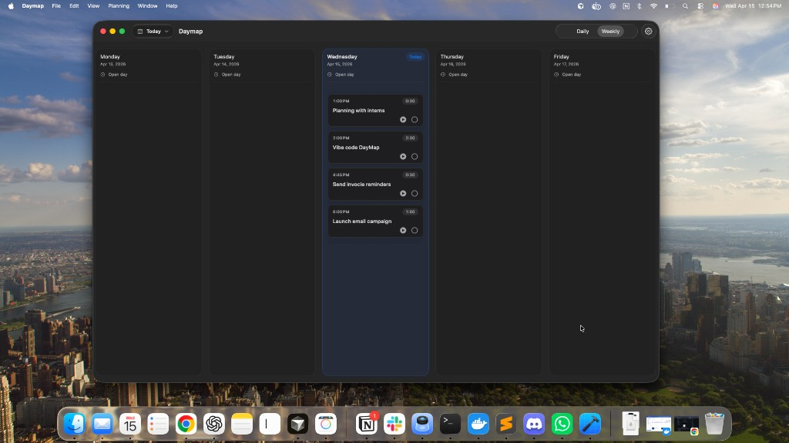
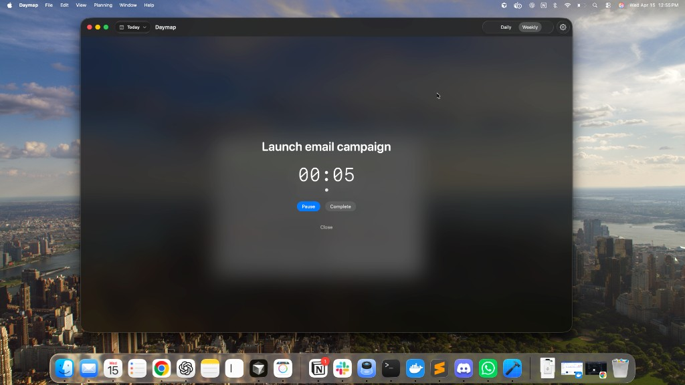

# Daymap

<p align="center">
  
</p>

<p align="center">
  A fast, minimal macOS daily planner with a timeline calendar view.
</p>

## What is Daymap?

Daymap is a macOS app (SwiftUI) for planning your day around time-blocked tasks. It includes:

- **Daily timeline view**: drag to move tasks, resize to adjust duration.
- **Task editor**: quick natural-language parsing for dates/times/durations and `#tags`.
- **Weekly view**: scan your week at a glance.

## Screenshots

### Daily (focus)



### Daily (timeline)



### Weekly



## Requirements

- **macOS**: 13+ recommended
- **Xcode**: 15+ recommended

## Run locally

- Clone:

```bash
git clone https://github.com/bhagaban/daymap.git
cd daymap
```

- Open the Xcode project:
  - Open `daymap/Daymap.xcodeproj`
  - Select the `Daymap` scheme
  - Press **Run** (⌘R)

## Build (Release)

In Xcode:

- Select **Product → Archive**
- Distribute/export as needed

## Data storage

Daymap stores data locally on your machine in **Application Support** (a JSON file). No server required.

## Contributing

Issues and pull requests are welcome. If you’re changing UI behavior, please include a short screen recording or screenshots.

## License

MIT. See `LICENSE`.
